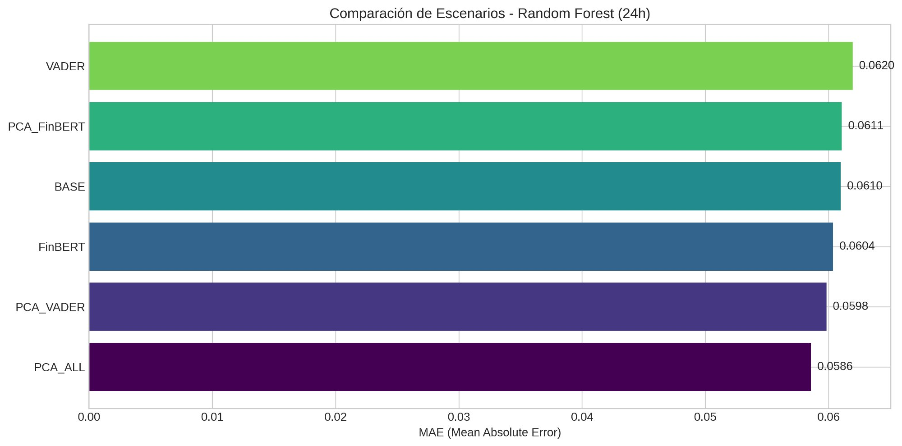
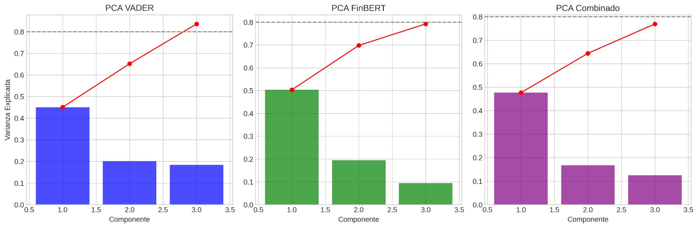
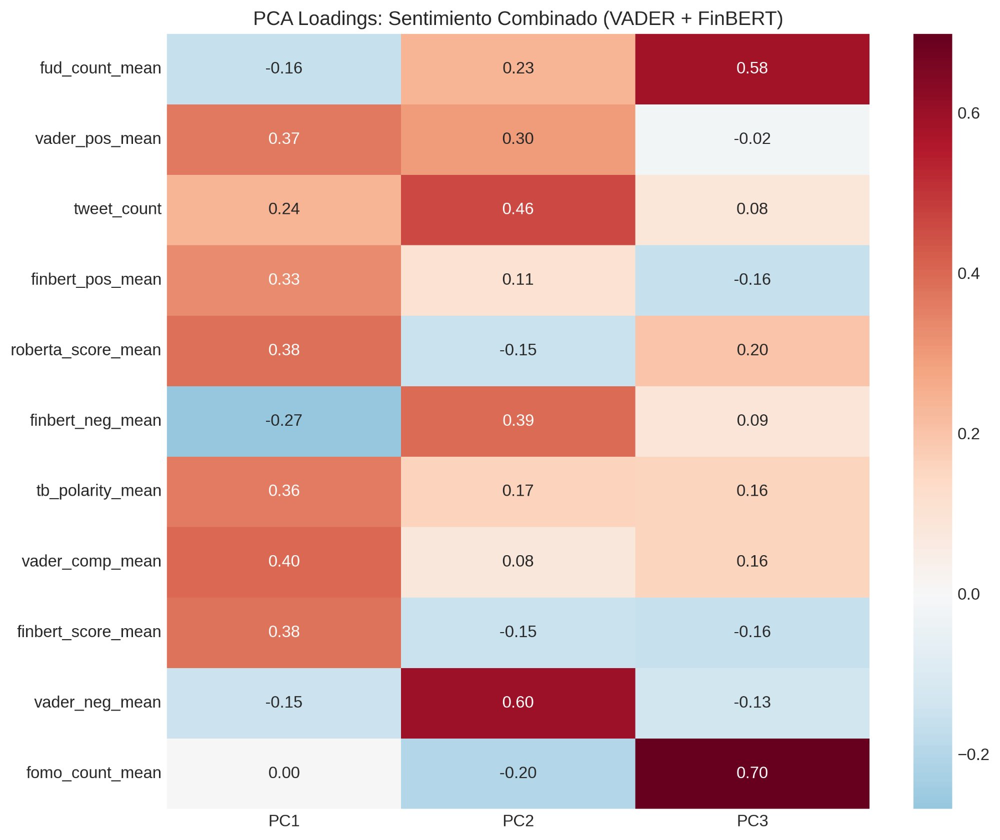
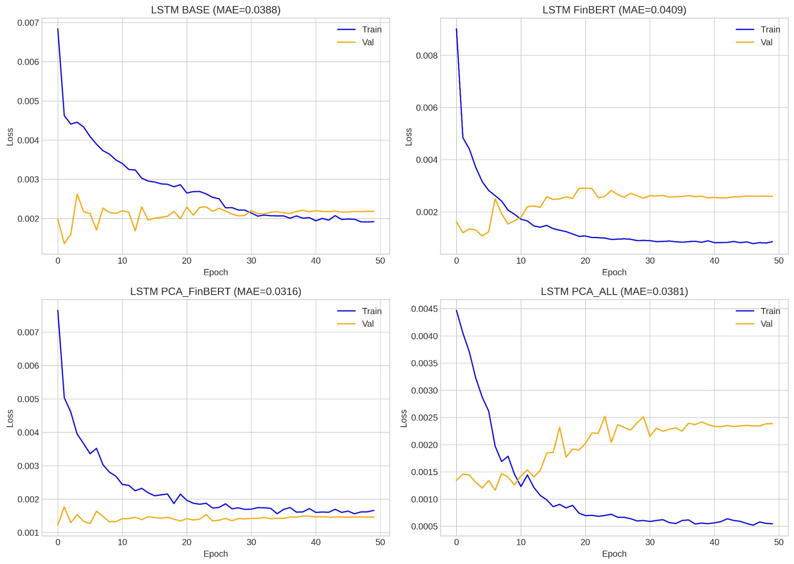
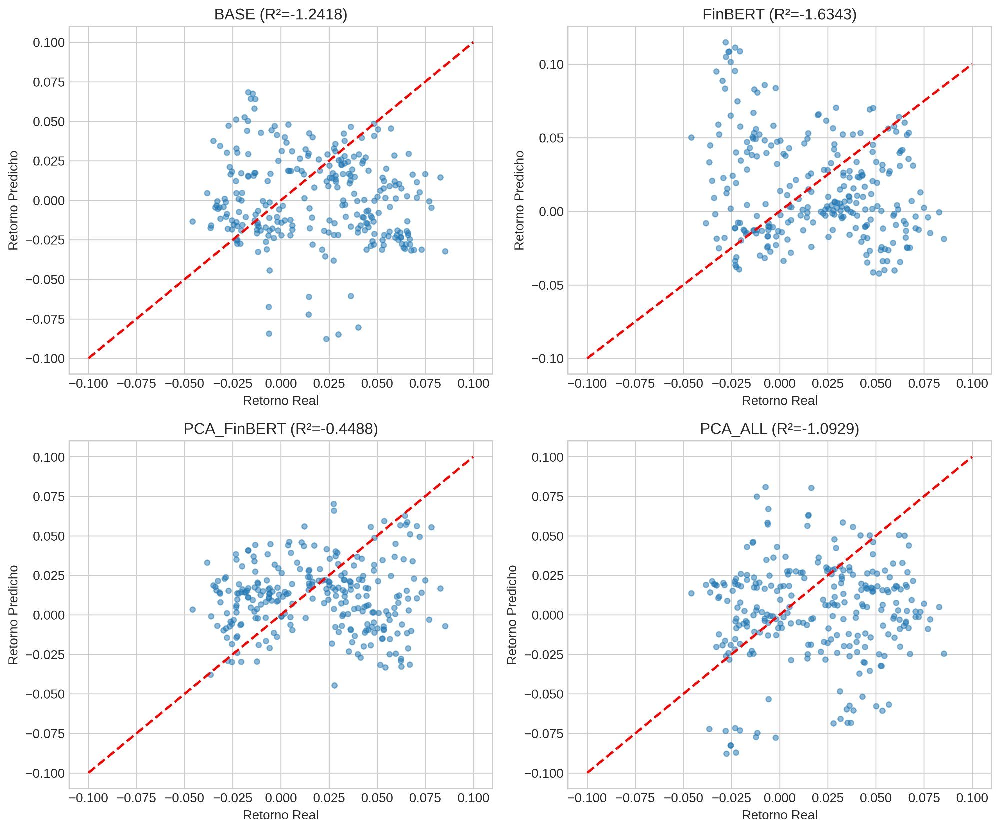

# Bitcoin Sentiment Analysis: FinBERT + PCA

[](https://www.python.org/downloads/)
[](https://pytorch.org/)
[](https://huggingface.co/transformers/)
[](LICENSE)
[](https://colab.research.google.com/)

<p align="center">
  
</p>

## 📌 Descripción

Este proyecto investiga la capacidad predictiva del sentimiento expresado en Twitter sobre el precio de Bitcoin, comparando métodos tradicionales de análisis de sentimiento (VADER, TextBlob) con modelos de NLP basados en Transformers (FinBERT, Twitter-RoBERTa) y técnicas de reducción de dimensionalidad (PCA).

**Autores:** Sebastián Marinovic, Ricardo Lizana, Luis Gutiérrez  
**Institución:** Universidad de Las Américas - Magíster en Data Science

---

## 🎯 Resultados Principales

### Mejor Modelo: LSTM + PCA_FinBERT

| Modelo | Escenario | MAE | Mejora vs BASE |
|--------|-----------|-----|----------------|
| **LSTM** | **PCA_FinBERT** | **0.0316** | **-18.6%** ✅ |
| LSTM | PCA_ALL | 0.0381 | -1.8% |
| Random Forest | PCA_ALL | 0.0586 | -3.9% |
| Random Forest | BASE | 0.0610 | -- |

### Correlación Sentimiento-Retornos (24h)

| Método | Correlación (ρ) | p-value | Significativo |
|--------|-----------------|---------|---------------|
| VADER | 0.027 | 0.302 | ❌ No |
| **FinBERT** | **0.113** | **1.53e-05** | ✅ **Sí (4x más fuerte)** |

> 💡 **Hallazgo clave:** FinBERT captura una correlación **4 veces más fuerte** que VADER con los retornos de Bitcoin.

---

## 📊 Visualización de Resultados

### Comparación de Escenarios (Random Forest)

<p align="center">
  
</p>

*PCA_ALL obtiene el mejor MAE (0.0586) para Random Forest, mejorando 3.9% sobre el baseline.*

### Análisis de Componentes Principales

<p align="center">
  
</p>

*Los 3 componentes principales capturan entre 77-84% de la varianza según la configuración.*

### PCA Loadings: Interpretación de Componentes

<p align="center">
  
</p>

**Interpretación:**
- **PC1 (47.7%):** Índice de sentimiento positivo general
- **PC2 (16.8%):** Volumen social y sentimiento negativo
- **PC3 (12.5%):** Señales FOMO/FUD (correlación negativa con retornos)

### Curvas de Aprendizaje LSTM

<p align="center">
  
</p>

*PCA_FinBERT muestra la convergencia más estable y el menor validation loss.*

### Predicciones vs Valores Reales

<p align="center">
  
</p>

*PCA_FinBERT (R²=-0.45) muestra mejor ajuste que los demás escenarios.*

---

## 📁 Estructura del Proyecto

```
bitcoin-sentiment-analysis-/
├── README.md
├── LICENSE
├── requirements.txt
├── .gitignore
│
├── notebooks/
│   ├── btc_finbert_tft_pca.ipynb           # Notebook FinBERT + PCA
│   └── btc_sentiment_final_with_pca.ipynb  # Notebook VADER + PCA
│
├── scripts/
│   ├── btc_sentiment_finbert_pca_v3.py     # Script principal (FinBERT + PCA)
│   └── btc_sentiment_final_with_pca.py     # Script VADER + PCA
│
├── results/
│   ├── figures/
│   │   ├── fig_scenario_comparison.png
│   │   ├── fig_pca_variance_comparison.png
│   │   ├── fig_pca_loadings_combined.png
│   │   ├── fig_lstm_learning_curves.png
│   │   └── fig_lstm_predictions.png
│   └── tables/
│       ├── mae_comparison.csv
│       ├── pca_loadings_combined.csv
│       ├── results_all_scenarios.csv
│       └── executive_summary_v3.txt
│
└── paper/
    └── main.tex
```

---

## 🚀 Instalación y Uso

### Opción 1: Google Colab (Recomendado) 🌟

```python
# Instalar dependencias
!pip install transformers torch kagglehub textblob nltk scikit-learn scipy --quiet

# Clonar repositorio
!git clone https://github.com/sebamarinovic/bitcoin-sentiment-analysis-.git
%cd bitcoin-sentiment-analysis-

# Ejecutar análisis
!python scripts/btc_sentiment_finbert_pca_v3.py
```

### Opción 2: Ejecución Local

```bash
# 1. Clonar repositorio
git clone https://github.com/sebamarinovic/bitcoin-sentiment-analysis-.git
cd bitcoin-sentiment-analysis-

# 2. Crear ambiente virtual
python -m venv venv
source venv/bin/activate  # Linux/Mac
# o: venv\Scripts\activate  # Windows

# 3. Instalar dependencias
pip install -r requirements.txt

# 4. Ejecutar
python scripts/btc_sentiment_finbert_pca_v3.py
```

### Datos Requeridos

| Dataset | Fuente | Descripción |
|---------|--------|-------------|
| Tweets | [Kaggle](https://www.kaggle.com/datasets/gautamchettiar/bitcoin-sentiment-analysis-twitter-data) | 1M tweets sobre Bitcoin |
| Precios | Binance | BTC/USDT horario (Feb-Ago 2021) |

---

## 📊 Metodología

### Pipeline de Análisis

```
Tweets (1M) → Limpieza → Sentimiento (VADER/FinBERT/RoBERTa) → Agregación Horaria
                                    ↓
                                   PCA
                                    ↓
                         Features Técnicos + PCA
                                    ↓
                    Modelos (Ridge/RF/LSTM) → Evaluación Walk-Forward
```

### Métodos de Sentimiento

| Método | Tipo | Tiempo | Correlación con Retornos |
|--------|------|--------|--------------------------|
| VADER | Léxico | ~1 min | ρ = 0.027 (no sig.) |
| TextBlob | Léxico | ~2 min | ρ = 0.031 (no sig.) |
| **FinBERT** | Transformer | ~1 hora | **ρ = 0.113 (p<0.001)** |
| RoBERTa | Transformer | ~1 hora | ρ = 0.089 (p<0.01) |

### Escenarios de Features

| Escenario | Features | Descripción |
|-----------|----------|-------------|
| BASE | 5 | Solo técnicos (RSI, volatilidad, momentum) |
| VADER | 12 | BASE + sentimiento VADER |
| FinBERT | 15 | BASE + sentimiento FinBERT |
| PCA_VADER | 8 | BASE + 3 componentes PCA de VADER |
| PCA_FinBERT | 8 | BASE + 3 componentes PCA de FinBERT |
| **PCA_ALL** | 8 | BASE + 3 componentes PCA combinados |

---

## 📈 Resultados Detallados

### Varianza Explicada por PCA

| Configuración | PC1 | PC2 | PC3 | Total |
|---------------|-----|-----|-----|-------|
| PCA_VADER | 45.1% | 20.1% | 18.4% | **83.6%** |
| PCA_FinBERT | 50.4% | 19.4% | 9.4% | **79.2%** |
| PCA_ALL | 47.7% | 16.8% | 12.5% | **76.9%** |

### Rendimiento de Modelos (MAE, horizonte 24h)

| Modelo | BASE | VADER | FinBERT | PCA_ALL |
|--------|------|-------|---------|---------|
| Naive | 0.0380 | 0.0380 | 0.0380 | 0.0380 |
| Ridge | 0.0556 | 0.0686 | 0.0660 | 0.0582 |
| Random Forest | 0.0610 | 0.0620 | 0.0604 | **0.0586** |
| **LSTM** | 0.0388 | -- | 0.0409 | 0.0381 |
| **LSTM + PCA_FinBERT** | -- | -- | -- | **0.0316** |

---

## 🔬 Conclusiones

1. **FinBERT > VADER:** Correlación 4x más fuerte con retornos (ρ=0.113 vs ρ=0.027)

2. **PCA mejora LSTM significativamente:** Reducción del 18.6% en MAE

3. **PCA actúa como regularizador:** Elimina ruido y multicolinealidad entre features de sentimiento

4. **Componentes interpretables:**
   - PC1: Sentimiento positivo general
   - PC2: Actividad social + negatividad
   - PC3: FOMO/FUD (correlación negativa)

5. **Eficiencia de mercado:** R² negativo sugiere predictibilidad limitada pero mejoras relativas significativas

---

## 📝 Citar

```bibtex
@mastersthesis{marinovic2026btcsentiment,
  author = {Marinovic, Sebastián and Lizana, Ricardo and Gutiérrez, Luis},
  title = {Efecto del Sentimiento en Redes Sociales sobre el Precio del Bitcoin},
  school = {Universidad de Las Américas},
  year = {2026},
  type = {Tesis de Magíster en Data Science}
}
```

---

## 📚 Referencias

- Araci, D. (2019). *FinBERT: Financial Sentiment Analysis with Pre-trained Language Models*
- Barbieri, F. et al. (2020). *TweetEval: Unified Benchmark for Tweet Classification*
- Hutto, C.J. & Gilbert, E. (2014). *VADER: A Parsimonious Rule-based Model*
- Kristoufek, L. (2013). *Bitcoin meets Google Trends and Wikipedia*
- Hochreiter, S. & Schmidhuber, J. (1997). *Long Short-Term Memory*

---

## 📄 Licencia

Este proyecto está bajo la Licencia MIT - ver [LICENSE](LICENSE) para más detalles.

---

## 🤝 Autores

| Autor | Rol |
|-------|-----|
| Sebastián Marinovic | Desarrollo, Análisis |
| Ricardo Lizana | Investigación, Documentación |
| Luis Gutiérrez | Modelado, Evaluación |

**Universidad de Las Américas** - Magíster en Data Science

---

<p align="center">
  <b>⭐ Si este proyecto te fue útil, considera darle una estrella ⭐</b>
</p>
