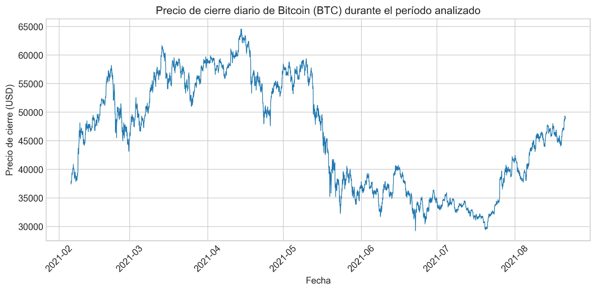
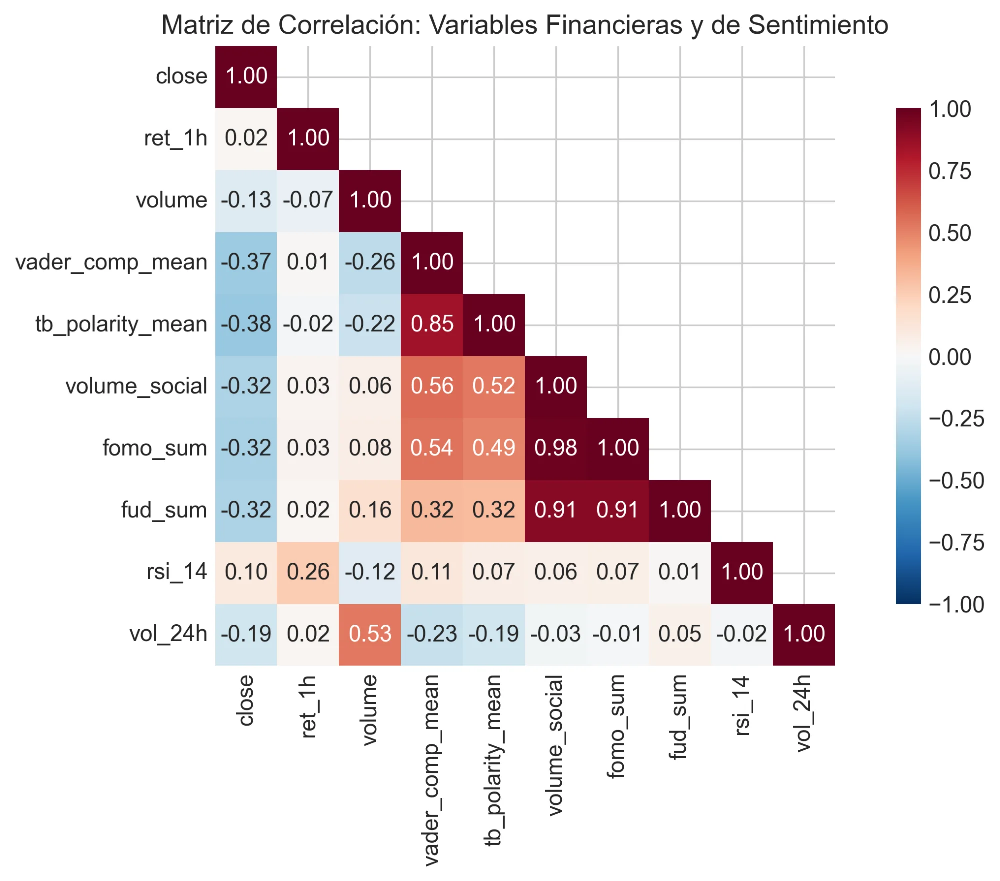
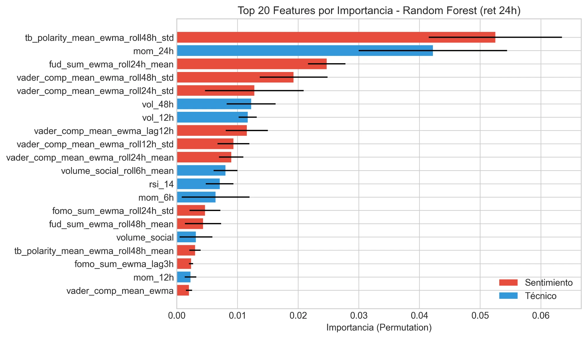

# 📈 Bitcoin Sentiment Analysis: Effect of Social Media on BTC Price

[](https://www.python.org/downloads/)
[](LICENSE)
[](https://jupyter.org/)

> **Tesis de Magíster en Data Science** - Universidad de Las Américas, Chile

## 👥 Autores

- **Sebastián Marinovic Leiva**
- **Ricardo Iván Lizana Aseña**  
- **Luis Andrés Gutiérrez González**

---

## 📋 Resumen

Este estudio analiza si el **sentimiento extraído de Twitter** posee capacidad predictiva sobre variaciones del precio de **Bitcoin** en ventanas de 1, 6 y 24 horas.

### 🔬 Metodología
- **905,863 tweets** analizados (Feb-Ago 2021)
- Análisis de sentimiento con **VADER** y **TextBlob**
- Modelos: Ridge Regression, Random Forest, **LSTM**
- Validación: Walk-Forward Cross-Validation (5 folds)

### 📊 Resultados Principales

| Métrica | Valor | Interpretación |
|---------|-------|----------------|
| Correlación Spearman | ρ = 0.088 | Significativa (p < 0.01) |
| Test de Wilcoxon | p = 0.683 | No significativo |
| Mejora MAE | -2.88% | Sin mejora |

**Conclusión:** A pesar de encontrar correlación estadísticamente significativa entre sentimiento y retornos, la incorporación de variables de sentimiento **no mejoró** el desempeño predictivo de los modelos.

---

## 📁 Estructura del Repositorio

```
bitcoin-sentiment-analysis/
├── 📓 BTC_Sentiment_Improved_Notebook_v3.ipynb  # Notebook principal
├── 📂 figures/                                   # Visualizaciones generadas
│   ├── fig1.png   # Precio BTC
│   ├── fig2.png   # Distribución sentimiento
│   ├── fig3.png   # Precio vs Sentimiento
│   ├── fig4.png   # Matriz de correlación
│   ├── fig5.png   # Correlación rolling
│   ├── fig6.png   # Cobertura social (heatmap)
│   ├── fig7.png   # Feature importance
│   ├── fig8.png   # Importancia por grupo
│   ├── fig9.png   # Distribución de error
│   ├── fig10.png  # Scatter predicciones
│   ├── fig11.png  # Event study
│   └── fig12.png  # LSTM results
├── 📂 paper/                                     # Paper académico
│   ├── main.tex
│   └── Efecto_del_Sentimiento_en_Redes_Sociales_sobre_el_Precio_del_Bitcoin.pdf
├── 📂 tables/                                    # Tablas de resultados
├── 📄 requirements.txt
├── 📄 README.md
└── 📄 LICENSE
```

---

## 🚀 Instalación y Uso

### Requisitos

```bash
pip install -r requirements.txt
```

### Ejecución

1. **Opción A: Google Colab** (Recomendado)
   - Sube `BTC_Sentiment_Improved_Notebook_v3.ipynb` a Google Colab
   - Ejecuta todas las celdas

2. **Opción B: Local**
   ```bash
   jupyter notebook BTC_Sentiment_Improved_Notebook_v3.ipynb
   ```

### Datos

Los datos se descargan automáticamente desde:
- **Tweets:** [Kaggle - Bitcoin Sentiment Analysis](https://www.kaggle.com/datasets/gautamchettiar/bitcoin-sentiment-analysis-twitter-data)
- **OHLCV:** Binance (BTCUSDT 1h)

---

## 📈 Visualizaciones

### Precio de Bitcoin


### Distribución de Sentimiento


### Matriz de Correlación


### Feature Importance


---

## 🔧 Tecnologías Utilizadas

| Categoría | Herramientas |
|-----------|--------------|
| **Lenguaje** | Python 3.9+ |
| **NLP** | VADER, TextBlob, NLTK |
| **ML** | Scikit-learn, TensorFlow/Keras |
| **Datos** | Pandas, NumPy |
| **Visualización** | Matplotlib, Seaborn |
| **Estadística** | SciPy, Statsmodels |

---

## 📊 Métricas de Evaluación

- **MAE** (Mean Absolute Error)
- **RMSE** (Root Mean Square Error)
- **R²** (Coeficiente de determinación)
- **Accuracy Direccional**
- **Test de Wilcoxon** (comparación pareada)
- **Correlación de Spearman**

---

## 📚 Referencias

1. Kristoufek, L. (2013). Bitcoin meets Google Trends and Wikipedia. *Scientific Reports*, 3, 3415.
2. Garcia, D., & Schweitzer, F. (2015). Social signals and algorithmic trading of Bitcoin. *Royal Society Open Science*.
3. Hutto, C. J., & Gilbert, E. (2014). VADER: A parsimonious rule-based model for sentiment analysis. *ICWSM 2014*.
4. Hochreiter, S., & Schmidhuber, J. (1997). Long short-term memory. *Neural Computation*.

---

## 📄 Licencia

Este proyecto está bajo la Licencia MIT - ver el archivo [LICENSE](LICENSE) para más detalles.

---

## 🤝 Contribuciones

Las contribuciones son bienvenidas. Por favor, abre un issue primero para discutir los cambios propuestos.

---

## 📧 Contacto

- **Sebastián Marinovic** - sebamarinovic.leiva@gmail.com
- **GitHub:** [@sebamarinovic](https://github.com/sebamarinovic)

---

<p align="center">
  <b>Universidad de Las Américas - Magíster en Data Science - 2026</b>
</p>
